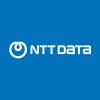
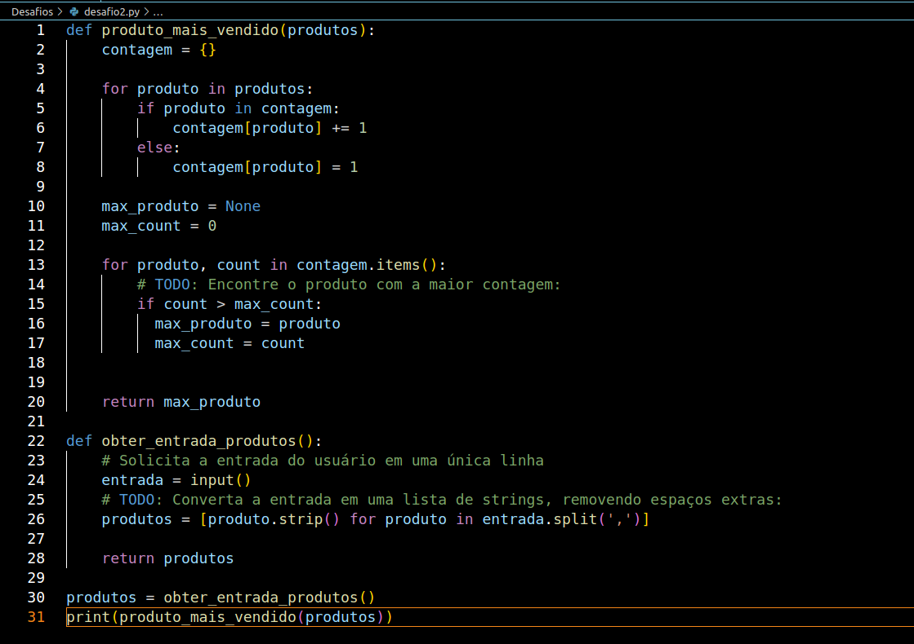

# NTT-DATA e DIO

Bootcamp da NTT-DATA e DIO INNOVATION ONE de Engenharia de dados com Python.
Neste repositório trago todos os meus aprendizados neste Bootcamp.

## OBJETIVO

Aprender sobre Engenharia e análise de dados com Python e todas as Hard Skills e SoftSkills necessárias para trabalhar nesta Stack.

## Linguagens utilizadas

**Front-end:** Jupyter Notebook

**Back-end:** python

## Documentação

[Documentação - Bootcamp Dio | NTT DATA](https://github.com/clenio77/NTT-DATA)

  
  

## Licença

[MIT](https://choosealicense.com/licenses/mit/)

## Screenshots

